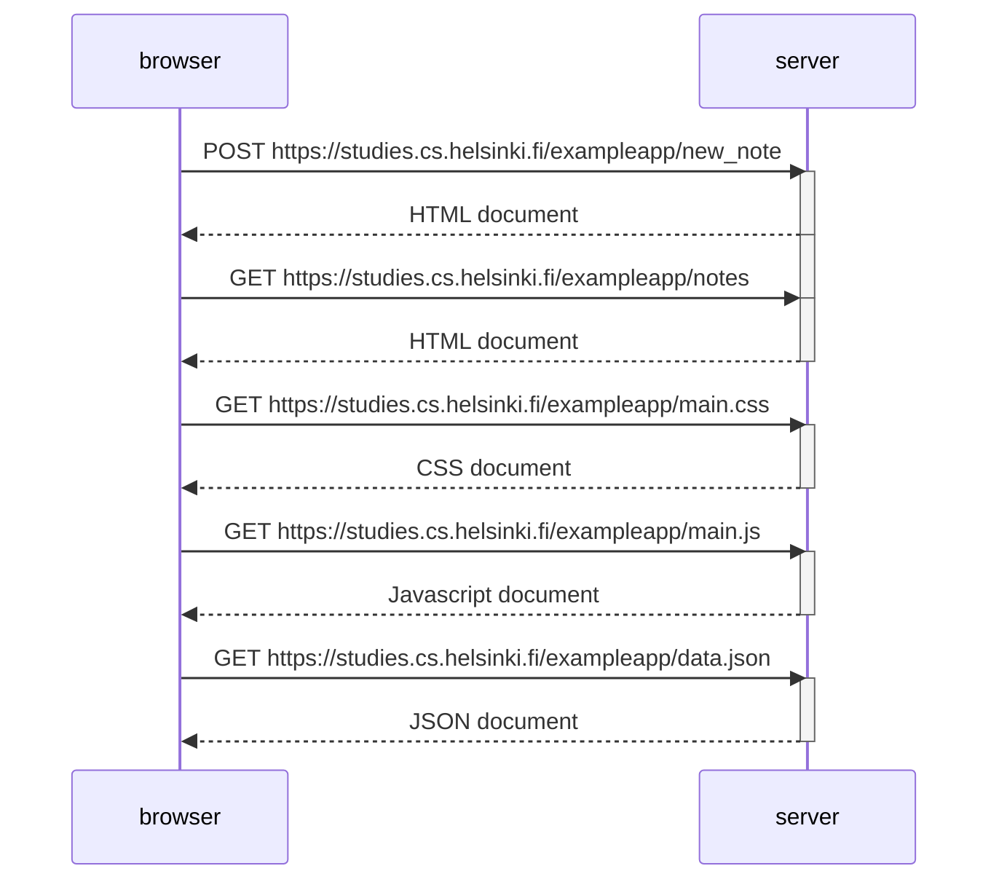

```mermaid
sequenceDiagram
    # action form is exectuded with POST Method
    browser->>server: POST https://studies.cs.helsinki.fi/exampleapp/new_note
    activate server
    server-->>browser: HTML document
    deactivate server 
    # a redirect to the location is executed /exampleapp/notes
    activate server
    browser->>server: GET https://studies.cs.helsinki.fi/exampleapp/notes    
    deactivate server

    # Then the page calls everything what is needed again 
    activate server
    server-->>browser: HTML document
    deactivate server

    # notes html has <link> tag that calls the css file 

    browser->>server: GET https://studies.cs.helsinki.fi/exampleapp/main.css
    activate server
    server-->>browser: CSS document
    deactivate server
    # notes also has a <script> tag that calls main.js
   
    browser->>server: GET https://studies.cs.helsinki.fi/exampleapp/main.js
    activate server
    server-->>browser: Javascript document
    deactivate server

    # get data JSON
    browser->>server: GET https://studies.cs.helsinki.fi/exampleapp/data.json
    activate server
    server-->>browser: JSON document
    deactivate server
```